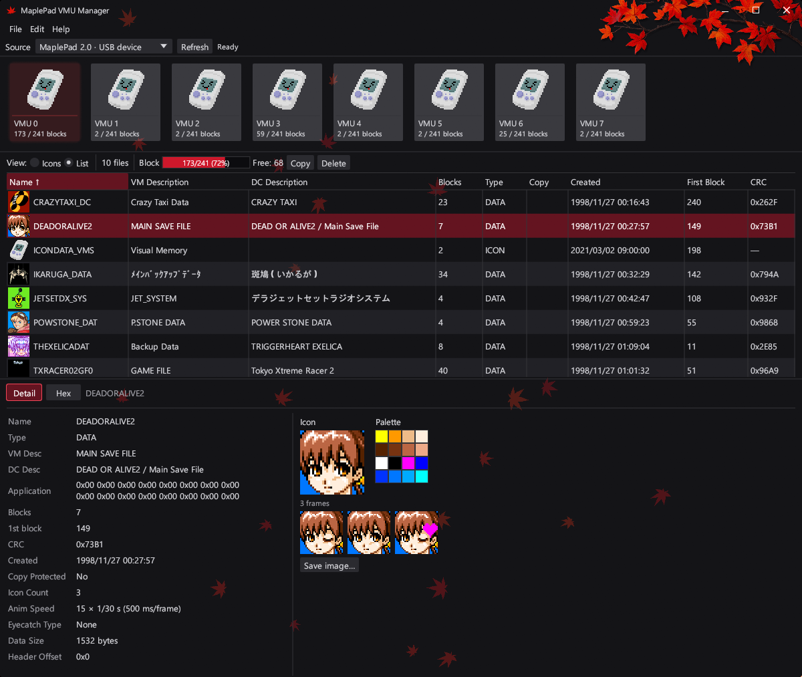
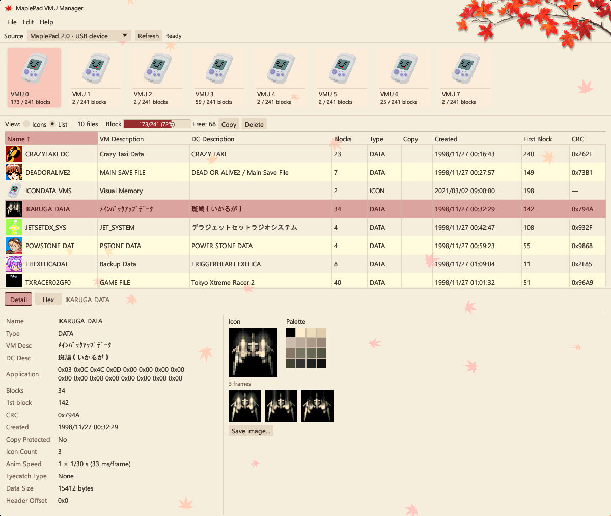
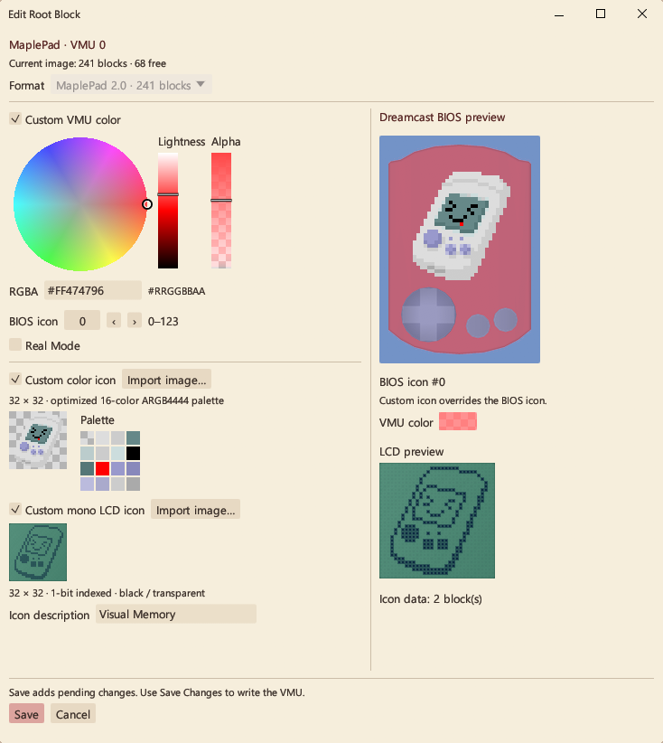
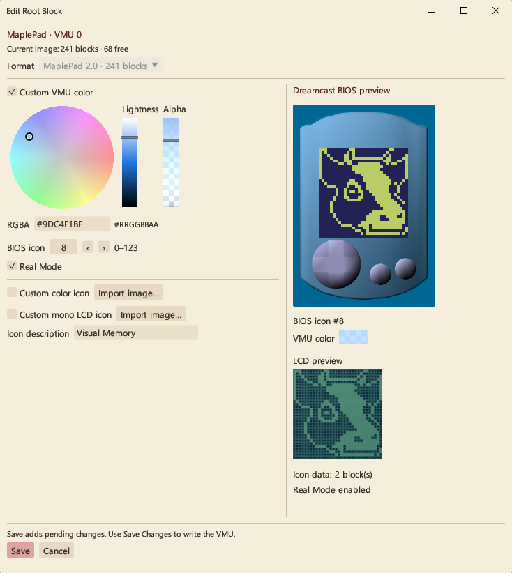

# 🍁 MaplePad VMU Manager

A beautiful Windows app for creating and editing Dreamcast VMU images, with native [MaplePad](https://github.com/mackieks/MaplePad) support, built with Rust and egui. 

Special thanks to [@pomegd](https://github.com/pomegd/vmu_manager) for the inspiration!

 

VMU Root Block Editor enables deep VMU customization, custom icon creation, Real Mode, and displays Dreamcast-accurate previews.

 

## Build

Requires Windows x64, [Rust](https://rustup.rs/), and Visual Studio Build Tools with **Desktop development with C++** and the Windows SDK. The pinned Rust toolchain is selected automatically.

```powershell
cargo build --release --locked
```

Run `target/release/maplepad-vmu-manager.exe`. All runtime assets and picotool are embedded; no separate downloads or asset conversion are needed. MaplePad USB access requires a working Raspberry Pi Pico / Pico 2 BOOTSEL driver.

## Development

```powershell
cargo fmt --check
cargo test --release --locked
```

## License

Application code: [MIT](LICENSE). Bundled third-party components are covered separately; see [notices](THIRD_PARTY_NOTICES.md).
